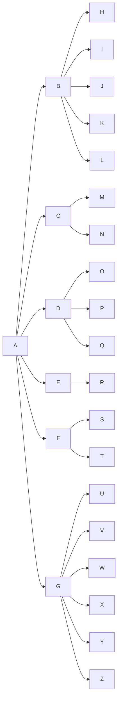

# 使用Markdown绘制简单的思维导图

## 说明

在 markdown 使用 mermaid 将流程图渲染成思维导图

## 工具

+ VSCode
+ Markdown Preview Mermaid Support：vscode 插件

## 参考

https://github.com/mermaid-js/mermaid

## example 1 
```
    ```mermaid
    graph TD;
        A-->B;
        A-->C;
        B-->D;
        C-->D;
    ```
```


## example 2

```bash


