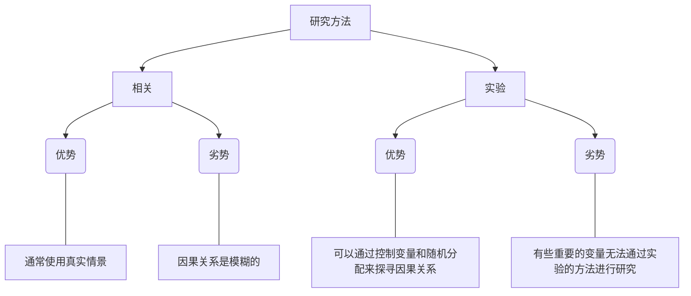

# 【社会心理学】导论

## 社会心理学中的重要观点

**社会心理学**是研究人们如何看待彼此，如何互相影响，互相联系的科学。它关注的核心问题是：

+ 我们如何构建我们的世界
+ 我们的社会直觉如何指引我们，而有时候又是如何误导我们的
+ 我们的社会行为如何受他人、我们自己的态度和性格以及生物性的影响
+ 社会心理学的原理是如何应用于我们的日常生活和其他研究领域中的

## 人类的价值观对社会心理学的影响

+ 社会心理学家的价值观直接影响其工作，如他们对研究课题的选择，以及它吸引的对各种研究领域感兴趣的人的类型。
+ 价值观同时也间接地影响这他们的工作，如当他们构建概念，选择描述标签，以及提供建议时隐藏的假设。
+ 意识到价值观对科学的渗透并不是我们责难社会心理学及其他任何科学的理由。正是因为人们思维鲜有不偏不倚，所以如果我们想要将自己所珍视的思想结晶与真实的社会现实互相验证的话，就需要系统的观察与实验研究。

## 我早就知道了：社会心理学只是常识吗

+ 社会心理学提出了似乎显而易见的结论，因此它是微不足道的。
+ 然而，实验研究表明，只有在事实揭晓之后结果才显得“显而易见”。
+ 这种后见之明（我早就知道了现象）常导致人们过高评价自己的判断与预测。

## 研究方法：如何从事社会心理学研究

